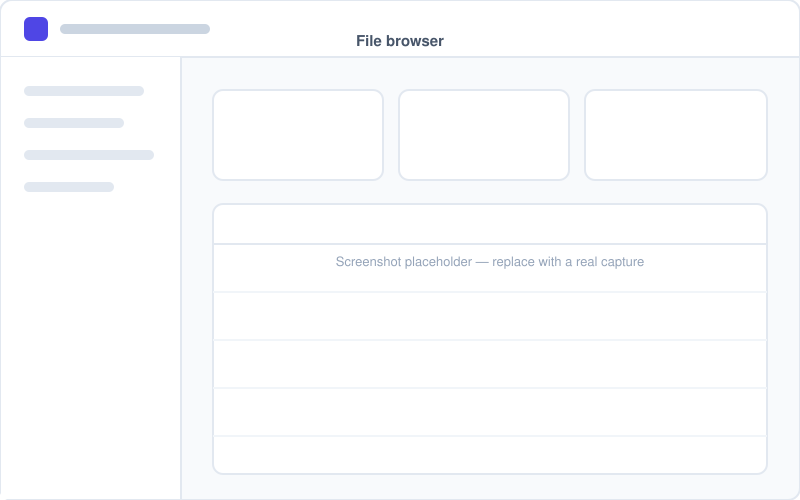
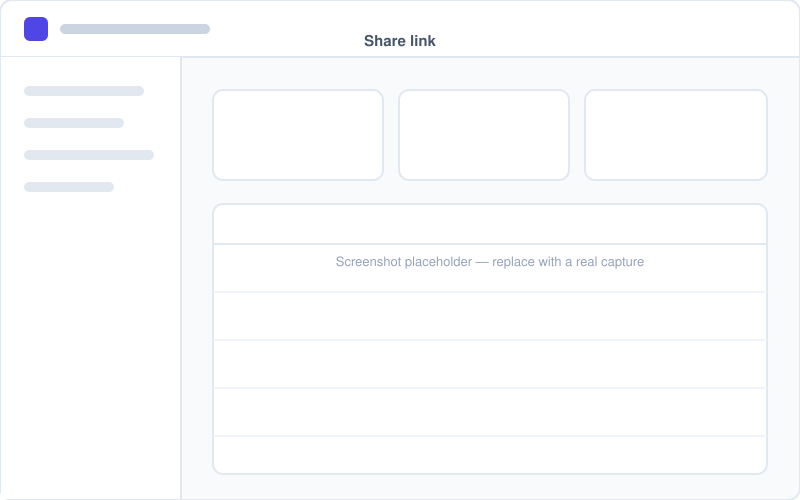
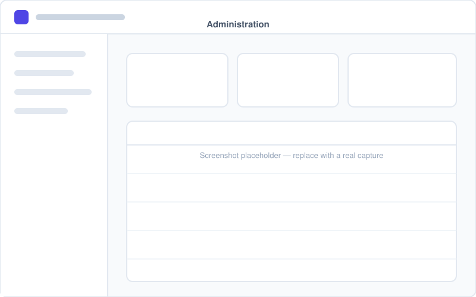

# File Sharing Portal

A self-hosted file sharing platform built with Ruby on Rails. Upload and
organise files, then hand out public links that recipients can use without
creating an account — a lightweight, self-hosted alternative to WeTransfer or a
company file portal.

Built for small companies, internal IT teams, homelab users and self-hosted
enthusiasts. It runs from a single container plus PostgreSQL, stores files
either on local disk or on any S3-compatible object store, and is configured
entirely through environment variables.

[](https://github.com/VictOliRodrigues/file-sharing-portal/actions/workflows/ci.yml)
[](https://github.com/VictOliRodrigues/file-sharing-portal/actions/workflows/docker.yml)
[](LICENSE)

---

## Table of contents

- [Overview](#overview)
- [Features](#features)
- [Screenshots](#screenshots)
- [Architecture](#architecture)
- [Installation](#installation)
- [Environment variables](#environment-variables)
- [Docker setup](#docker-setup)
- [Local development](#local-development)
- [Deployment](#deployment)
- [Coolify deployment](#coolify-deployment)
- [Security notes](#security-notes)
- [Testing](#testing)
- [Roadmap](#roadmap)
- [Contributing](#contributing)
- [License](#license)

---

## Overview

The portal gives every account its own drive: a tree of folders holding
uploaded files, with a trash that keeps deleted items recoverable. Any file or
folder can be published as a **share link** — an unguessable URL that works
without an account and that can carry an expiry date, a download limit and a
password.

Everything a recipient can reach is decided by the share link itself, so a link
to one folder can never be walked upwards into the rest of the owner's drive.
No file is ever served directly by the web server: every byte is streamed
through the application, after authorisation, so storage paths and object keys
never reach a client.

## Features

**Accounts**

- Registration, sign in, sign out and password reset by email
- Passwords hashed with bcrypt, sessions stored server side and revocable
- Profile editing, password change and a list of active sessions you can revoke
- Open registration, or invite-only with accounts provisioned by an administrator

**Files and folders**

- Upload one or many files at a time
- Nested folders, with rename and move
- Rename files and move them between folders
- Soft delete to a trash, restore, and permanent deletion
- File details: name, size, MIME type, upload date, download count, last
  download, owner and folder
- Inline previews for a short allowlist of raster image types

**Sharing**

- Public share links for a single file or for a whole folder
- Optional expiry date, download limit and password
- Revoke a link at any time, keeping its usage history
- Recipients download without an account and never see anything outside the
  shared item

**Search**

- Match part of a file or folder name, case insensitively
- Restrict to a folder and everything underneath it
- Filter by file type, based on the sniffed content type rather than the extension

**Dashboard**

- Total files, storage used against quota, recent uploads and recent downloads

**Administration**

- Deployment-wide statistics: users, files, folders, storage, share links and
  download activity, broken down by file type and by largest account
- List, inspect, disable, re-enable and delete accounts
- Provision accounts and set per-account storage quotas
- Grant or revoke administrator rights

**Operations**

- Single container plus PostgreSQL, health check endpoint at `/up`
- Local disk or any S3-compatible object store, switched by one variable
- Maintenance tasks for purging old trash and orphaned blobs

## Screenshots

> Screenshots go in `docs/screenshots/`. Replace the placeholders below with
> real captures of your deployment.

| Dashboard | File browser |
| --- | --- |
|  |  |

| Share link | Administration |
| --- | --- |
|  |  |

## Architecture

```
                    ┌──────────────────────────┐
   Browser ────────▶│ Reverse proxy (TLS)      │
   Share recipient  │ nginx / Traefik / Caddy  │
                    └────────────┬─────────────┘
                                 │ HTTP
                    ┌────────────▼─────────────┐
                    │ Thruster                 │  asset caching + compression
                    ├──────────────────────────┤
                    │ Puma                     │
                    ├──────────────────────────┤
                    │ Rack::Attack             │  throttling
                    ├──────────────────────────┤
                    │ Rails 8.1                │
                    │  · Hotwire (Turbo +      │
                    │    Stimulus), Tailwind   │
                    │  · Active Storage        │
                    └──────┬────────────┬──────┘
                           │            │
              ┌────────────▼───┐   ┌────▼──────────────────┐
              │ PostgreSQL     │   │ Local disk  or        │
              │ metadata       │   │ S3-compatible storage │
              └────────────────┘   └───────────────────────┘
```

**Stack**

| Layer | Choice |
| --- | --- |
| Language | Ruby 3.4 |
| Framework | Rails 8.1 |
| Database | PostgreSQL 14 or newer |
| Front-end | Hotwire (Turbo + Stimulus), Tailwind CSS 4, import maps, Propshaft |
| File storage | Active Storage — local disk or S3-compatible |
| Authentication | `has_secure_password` (bcrypt) with server-side sessions |
| Throttling | Rack::Attack |
| Tests | Minitest |
| Container | Multi-stage Dockerfile, Puma behind Thruster |

**Domain model**

| Model | Purpose |
| --- | --- |
| `User` | Account, administrator flag, disabled state, storage quota |
| `Session` | One signed-in browser; deleting it revokes access immediately |
| `Folder` | Per-user tree, soft deletable, cycle-free |
| `StoredFile` | Metadata for an Active Storage blob, soft deletable |
| `ShareLink` | Public token for a file or folder, with expiry, limit and password |
| `Download` | One recorded download, by an account or through a share link |

A deeper description lives in [docs/architecture.md](docs/architecture.md).

## Installation

The fastest path is Docker Compose. To run without containers you need Ruby
3.4, PostgreSQL 14 or newer and libvips.

```bash
git clone https://github.com/VictOliRodrigues/file-sharing-portal.git
cd file-sharing-portal
cp .env.example .env
```

Edit `.env` — at minimum set `SECRET_KEY_BASE`, `POSTGRES_PASSWORD` and
`APP_HOST`. Generate a secret with:

```bash
docker compose run --rm web bin/rails secret
```

Then start the stack:

```bash
docker compose up -d --build
```

The application is available on `http://localhost:3000`. **The first account
you register becomes an administrator**, so create it right away. Alternatively
set `ADMIN_EMAIL` and `ADMIN_PASSWORD` and run `bin/rails db:seed`.

Migrations run automatically when the container starts, so the project comes up
cleanly on an empty database.

## Environment variables

Every setting is read from the environment. [`.env.example`](.env.example) is
the authoritative list and documents each entry; the table below covers the
ones you are most likely to touch.

| Variable | Default | Purpose |
| --- | --- | --- |
| `SECRET_KEY_BASE` | — | **Required in production.** Long random string, unique per deployment |
| `APP_NAME` | `File Sharing Portal` | Name shown in the interface and in emails |
| `APP_HOST` | — | Public hostname, used to build links in emails and share URLs |
| `RAILS_MAX_THREADS` | `5` | Request threads and database connections per process |
| `WEB_CONCURRENCY` | `0` | Puma workers. Keep 0 unless `REDIS_URL` is set |
| `FORCE_SSL` | `true` | Redirect to HTTPS, enable HSTS, mark cookies secure |
| `ASSUME_SSL` | `true` | Trust `X-Forwarded-Proto` from the reverse proxy |
| `ALLOWED_HOSTS` | empty | Comma separated `Host` allowlist. Empty accepts any host |
| `DATABASE_URL` | — | Full connection string; overrides the `POSTGRES_*` values |
| `POSTGRES_HOST` / `_PORT` / `_USER` / `_PASSWORD` / `_DB` | see `.env.example` | Used when `DATABASE_URL` is absent |
| `ACTIVE_STORAGE_SERVICE` | `local` | `local` or `s3` |
| `STORAGE_PATH` | `/rails/storage` | Where the local disk service writes. Mount a volume here |
| `S3_BUCKET` / `S3_REGION` / `S3_ACCESS_KEY_ID` / `S3_SECRET_ACCESS_KEY` | — | Required when `ACTIVE_STORAGE_SERVICE=s3` |
| `S3_ENDPOINT` | — | Set for MinIO, Cloudflare R2, Backblaze B2, Wasabi and friends |
| `MAX_UPLOAD_SIZE_MB` | `512` | Largest accepted single upload |
| `DEFAULT_STORAGE_QUOTA_MB` | `0` | Per-account quota. 0 means unlimited |
| `ALLOW_REGISTRATION` | `true` | Set to `false` for an invite-only deployment |
| `MAX_SHARE_LINK_DAYS` | `0` | Upper bound on share link lifetime. 0 means no bound |
| `UPLOAD_ALLOWED_EXTENSIONS` | empty | When set, only these extensions are accepted |
| `UPLOAD_BLOCKED_EXTENSIONS` | empty | These extensions are always rejected |
| `MAIL_FROM` | `no-reply@example.com` | Sender for password reset emails |
| `SMTP_ADDRESS` and friends | — | Leave `SMTP_ADDRESS` empty to log emails instead of sending |
| `RATE_LIMIT_ENABLED` | `true` | Master switch for Rack::Attack |
| `RATE_LIMIT_REQUESTS` | `300` | Requests per IP per 5 minutes before throttling |
| `REDIS_URL` | — | Only needed when running more than one Puma worker or container |
| `TRASH_RETENTION_DAYS` | `30` | Used by `bin/rails portal:purge_trash` |

`.env` is git-ignored and must never be committed. CI fails the build if it
ever is.

## Docker setup

Two Compose files are provided.

**Production-style stack** — `docker-compose.yml` builds the production image,
runs PostgreSQL alongside it and keeps uploads on a named volume:

```bash
cp .env.example .env      # then edit it
docker compose up -d --build
docker compose logs -f web
```

**Development stack** — `docker-compose.dev.yml` bind-mounts the source tree so
edits take effect immediately, and runs the Tailwind watcher:

```bash
docker compose -f docker-compose.dev.yml up --build
```

The image itself is a multi-stage build: gems and assets are compiled in a
build stage that is thrown away, and the final image runs as an unprivileged
user with a health check on `/up`.

```bash
docker build -t file-sharing-portal .
docker run -d -p 3000:80 --env-file .env \
  -v portal_storage:/rails/storage file-sharing-portal
```

## Local development

Without containers:

```bash
bin/setup          # installs gems, prepares the database, starts the server
```

Or step by step:

```bash
bundle install
bin/rails db:prepare
bin/dev            # Rails server plus the Tailwind watcher
```

Useful commands:

```bash
bin/rails test                 # the whole suite
bin/rubocop                    # style
bin/brakeman --no-pager        # static security analysis
bin/bundler-audit              # gem advisories
bin/ci                         # everything CI runs, in one go
```

More detail in [docs/development.md](docs/development.md).

## Deployment

The application is a plain Docker container that needs PostgreSQL and a
writable volume (or an S3 bucket). It does not depend on any particular
platform.

**On a VPS with Docker Compose**

```bash
git clone https://github.com/VictOliRodrigues/file-sharing-portal.git
cd file-sharing-portal
cp .env.example .env          # set SECRET_KEY_BASE, POSTGRES_PASSWORD, APP_HOST
docker compose up -d --build
```

Then put a reverse proxy in front of it to terminate TLS and forward to port
3000. Keep `FORCE_SSL=true` and `ASSUME_SSL=true` so the app trusts
`X-Forwarded-Proto` and issues secure cookies.

**Bare metal or a plain container**

Set the environment variables, run `bin/rails db:prepare`, and start
`bin/thrust bin/rails server`. The container entrypoint already waits for the
database and runs pending migrations on boot.

Backups cover two things: the PostgreSQL database and the file storage
(`STORAGE_PATH` or the S3 bucket). Restoring one without the other leaves
metadata and bytes out of step.

Full instructions, including TLS, backups and upgrades, are in
[docs/deployment.md](docs/deployment.md).

## Coolify deployment

The project deploys on Coolify without using anything Coolify-specific — it is
an ordinary Dockerfile application.

1. Create a new **Docker Compose** or **Dockerfile** resource pointing at your
   fork of this repository.
2. Add a **PostgreSQL** database resource and copy its connection string into
   `DATABASE_URL`.
3. Set the environment variables from `.env.example`. At minimum:
   `SECRET_KEY_BASE`, `DATABASE_URL`, `APP_HOST`, and `ACTIVE_STORAGE_SERVICE`.
4. Add a **persistent volume** mounted at `/rails/storage` when using local
   storage. Skip this when using S3.
5. Set the exposed port to **80** and let Coolify handle TLS.
6. Deploy. Migrations run automatically on boot; the health check on `/up` tells
   Coolify when the container is ready.

Nothing above ties the application to Coolify: the same image runs unchanged
under Docker Compose, Kubernetes, Dokku or a plain `docker run`.

## Security notes

Security was a first-class concern rather than an afterthought. In short:

- **Authentication** — bcrypt password hashing, server-side sessions in a signed
  HttpOnly `SameSite=Lax` cookie, session rotation on sign in, and immediate
  revocation when an account is disabled or its password changes.
- **Authorisation** — every query is scoped through the signed-in user's own
  associations, so a record belonging to somebody else cannot be loaded at all
  rather than being loaded and then rejected.
- **File handling** — uploaded names are never trusted: directory components,
  control characters and null bytes are stripped on upload *and* on rename.
  Storage keys are generated by Active Storage and never derived from user
  input. Content types come from magic-byte sniffing, not from the client.
- **Serving files** — Active Storage's own routes are disabled. Every byte is
  streamed through a controller that checks ownership or share link validity
  first, so no storage path or object key is ever exposed. Downloads are always
  `Content-Disposition: attachment` except for a short allowlist of raster
  images, and types a browser would execute are sent as
  `application/octet-stream`.
- **Share links** — unguessable tokens, optional expiry, download limit and
  password. A single containment check gates every public request, so a folder
  link cannot be walked upwards or sideways.
- **Transport and headers** — HSTS, a strict Content Security Policy with a
  per-response nonce and no `unsafe-inline`, `X-Frame-Options: DENY`, `nosniff`,
  a referrer policy and a permissions policy.
- **Abuse** — Rack::Attack throttles sign in attempts per account and per
  address, password reset requests, share link password guessing and overall
  request volume.
- **Secrets** — nothing is stored in source. Everything comes from the
  environment, `.env` is git-ignored, and CI fails if one is ever committed.

The full analysis, including the threat model and the trade-offs that were
deliberately accepted, is in [docs/security.md](docs/security.md). To report a
vulnerability, see [SECURITY.md](SECURITY.md).

## Testing

The suite is Minitest and covers the security-sensitive paths as well as the
happy paths:

```bash
bin/rails test
```

It exercises authentication and session revocation, authorisation across
accounts, uploads and download accounting, filename sanitisation and traversal
attempts, folder trees and cycle prevention, share link expiry, limits,
passwords and containment, search filtering and SQL escaping, the administration
area, CSRF protection, rate limiting and the security headers.

## Roadmap

- [ ] Chunked and resumable uploads for very large files
- [ ] Bulk actions: multi-select, download a folder as a zip
- [ ] Notification emails when a share link is used
- [ ] Two-factor authentication (TOTP)
- [ ] Audit log for administrators
- [ ] Per-folder sharing with named recipients rather than an open link
- [ ] Optional virus scanning hook (ClamAV) on upload
- [ ] Full-text search inside documents
- [ ] Trash auto-purge scheduled inside the app rather than by cron
- [ ] Localisation beyond English

## Contributing

Bug reports and pull requests are welcome. Please read
[CONTRIBUTING.md](CONTRIBUTING.md) first — it covers the development setup, the
checks that have to pass, and the commit message convention.

## License

Released under the [MIT License](LICENSE).
